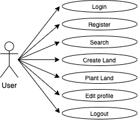
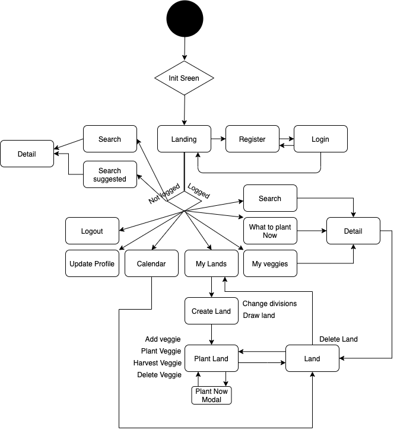
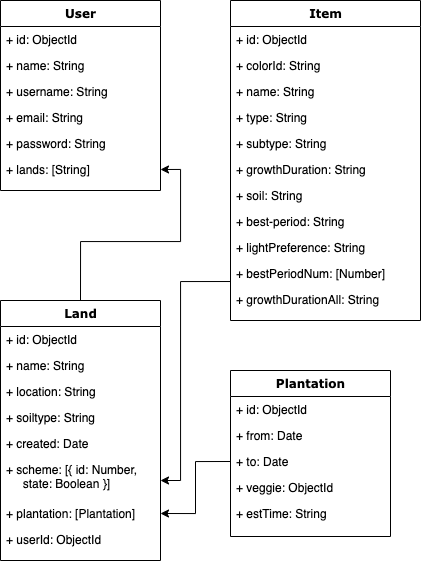
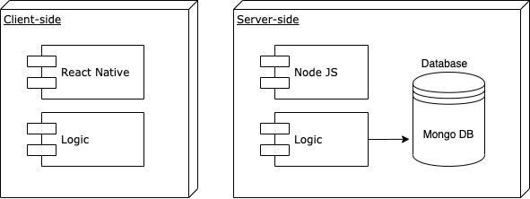
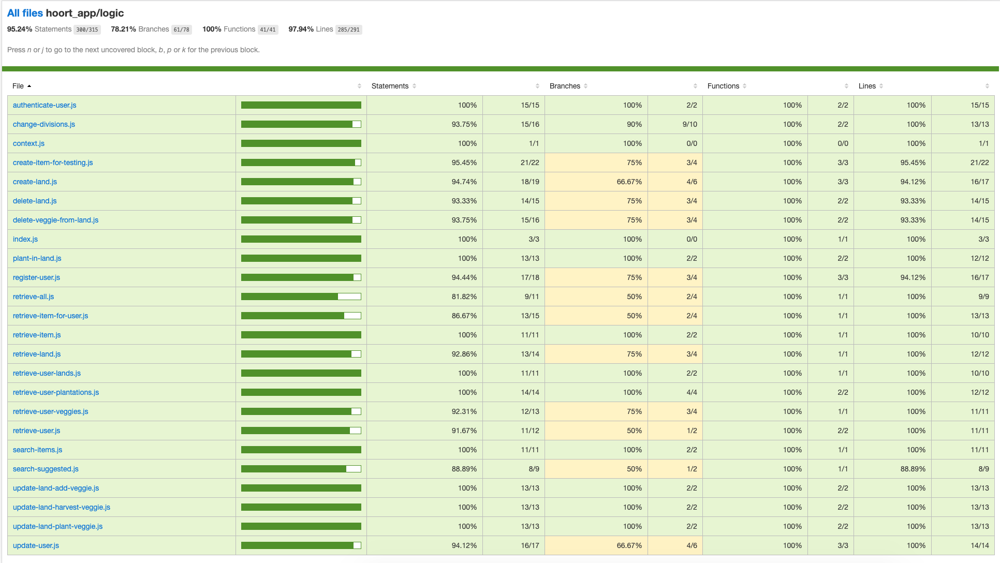
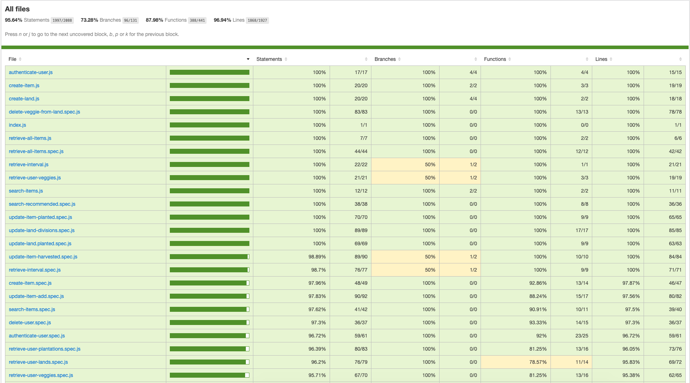
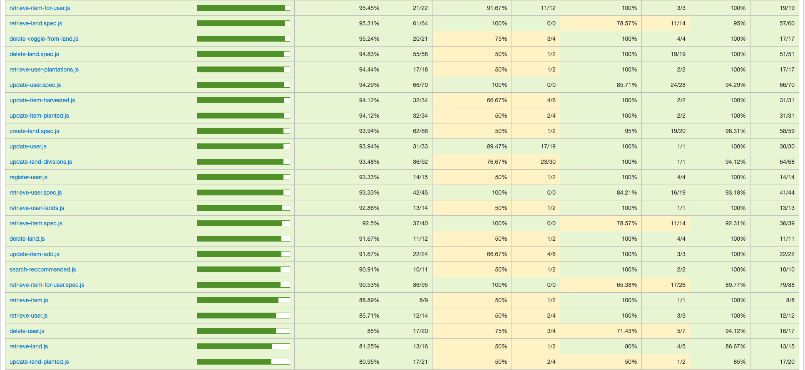

# HOORT 🌱

HOORT exists to help you manage your crops. Allows you to draw your land and to decide where to plant what veggie or fruit. You get access to a calendar with a prediction of when you'll harvest what you have sown.

<!--  -->

<!--  -->

# 🍀 Description

Have you always wanted to grow your own vegetables and fruits, and could really use some help planning your lands? Among others, this app helps on on that.

You can now draw your land and plan it through a user-friendly interface. You can decide where to plant what and when you actually plant you veggies and fruits. If you warn the app when you harvest them, you'll know what your average growth time for this veggie was.

The app gives you standard info on the veggies, and, upon signing in, allows you access to info like the average time of growth for each vegetable for the app users, your own personal average time of growth for your veggies and where do you have this item planted.

A calendar is displayed to help predict when is the time to start thinking about harvesting.

# 🍀 Functional description

If the user is not loogged in, they can:

<ul>
    <li>Search veggies</li>
    <li>Search what to plant now</li>
    <li>Go to details</li>
</ul>

Otherwise, a registered and logged user is allowed to:

<ul>
    <li>Search veggies</li>
    <li>Search what to plant now</li>
    <li>Consult their planted veggies</li>
    <li>Go to details</li>
    <li>See their lands</li>
    <li>Create a new land</li>
    <ul>
        <li>Change land divisions</li>
        <li>Draw the land</li>
    </ul>
    <li>Plant in that land</li>
    <ul>
        <li>Add a veggie</li>
        <li>Plant a veggie</li>
        <li>Harvest a veggie</li>
        <li>Delete a veggie</li>
    </ul>
    <li>Edit an already planted land</li>
    <li>Check out estimated harvesting periods for each veg in calendar</li>
    <li>Edit profile</li>
    <li>Logout</li>
</ul>

## Flowchart

## Data model

## Blocks

# 🍀 Code coverage

### Client-side coverage

### Server-side coverage

## Trello
[HOORT Trello](https://trello.com/b/dONyUBCB/hoort)